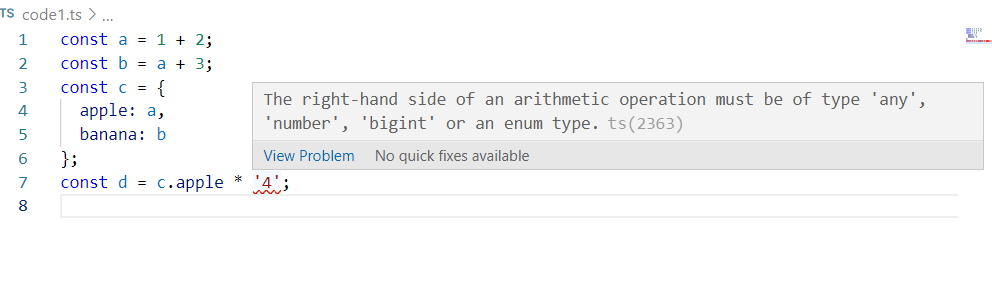

A diferencia de Javascript, en Typescript no se pueden hacer operaciones con distintos tipos de datos. La ventaja que tiene esto es que nos ayuda a la hora de programar, para que nos demos cuenta que estamos haciendo operaciones que no tienen sentido y que estamos tratando con distintos tipos de datos.

- 1.  Para cada uno de los valores del fichero code2.ts, ¿Qué tipo de datos inferirá TypeScript? Explica por qué se ha inferido este tipo de datos.

const a = 1042; --> number
const b = 'apples and oranges'; --> string
const c = 'pineapples'; --> string
const d = [true, true, false]; --> array[boolean]
const e = { type: 'ficus' }; --> object
const f = [1, false]; --> array[any]
const g = [3]; --> array[number]
const h = null; --> any

- 2. ¿Por qué se dispara cada uno de los errores del fichero code3.ts? 

const i: 3 = 3;
i = 4; --> no podemos volver a asignar un valor a una variable const (que es constante)

const j = [1, 2, 3];
j.push(4);
j.push('5'); --> j es del tipo array[number], entoces no podemos agregar un string a este array

let k: never = 4; --> never nos sirve para indicar que nunca tendra lugar esa variable (no se utilizara), y no se puede asignar ningun valor a 
este tipo de dato.

let l: unknown = 4;
let m = l * 2; --> con el tipo de dato unknow, el procesador no sabe que tipo de dato exacto es, y sin una comprovación del tipo
con el typeof, no podemos asignar ningun valor.

- 3. ¿Cuál es la diferencia entre una clase y una interface en TypeScript?

Una clase nos sirve para indicar que atributos tendrà, y poder llamar a su constructor para crear un objeto de esta clase.
En canvio, una interface tambien podemos definir atributos y metodos, pero nos sirve para que las clase que heredan de ella, 
esten obligadas a utilitzar sus atributos y metodos.
